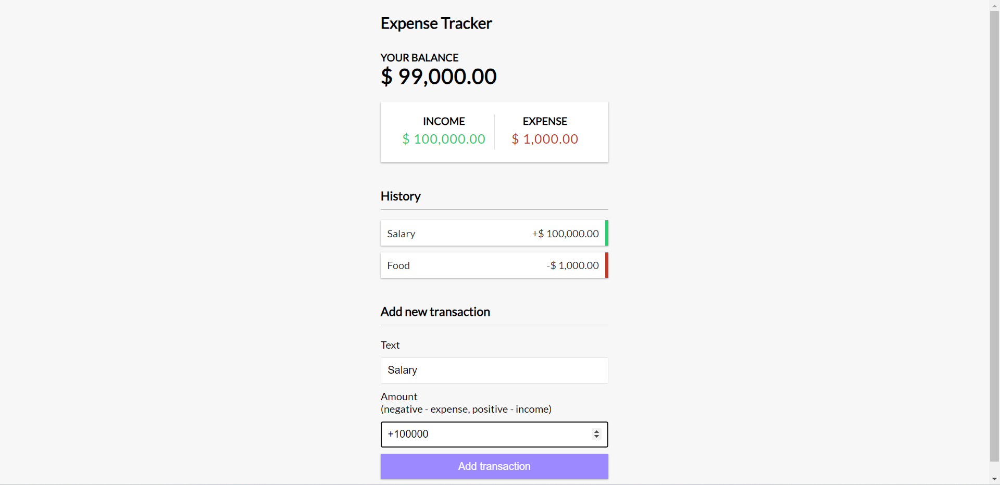

# Expense-tracker

## Setup  
Run ```npm install``` to install dependencies  

## Features
Input incomes and expenses  
Check the available balance  
Add spending in particular category  

## App page

